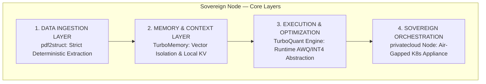
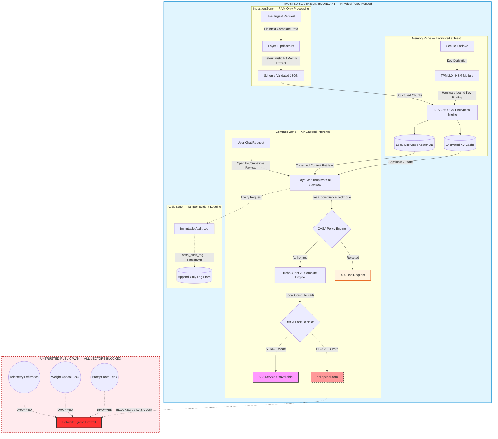
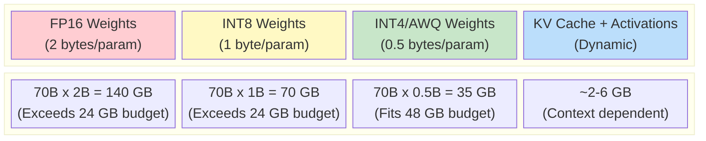

# Open Architecture Specification for Autonomous and Sovereign AI (OASA)

**Version:** 2026.1  
**Status:** Architecture Blueprint  
**Target:** Local-First, Air-Gapped, High-Efficiency Enterprise AI Infrastructure  
**License:** Apache-2.0  

---

## 1. Core Paradigm & Philosophy

The OASA standard defines an architectural framework where **Computation** and **Cognitive Memory** must remain bound to the physical geography of the asset owner.

OASA strictly rejects the thin-client SaaS model in favor of the **Sovereign Node** topology, neutralizing the data-harvesting mechanics of centralized financial capital (Д → Д').

### The Three Absolute Axioms of OASA

#### Axiom 1 — Zero Exfiltration
No weight updates, prompt tokens, context embeddings, telemetry, or behavioral metadata may traverse a public network boundary without explicit, cryptographically signed user consent.

#### Axiom 2 — Hardware Agnosticism via Quantization
The architecture must execute enterprise-grade cognitive tasks on commodity, on-premise hardware through aggressive layer-wise compression and quantization.

#### Axiom 3 — API Idempotency
Local ingestion and execution layers must serve as a **drop-in replacement** for public AI cloud protocols.

---

## 2. The Four-Layer Architectural Stack & Trust Boundaries

### Visual Architectural Stack



### Trust Boundary & Threat Model

OASA establishes strict cryptographic and physical isolation barriers to prevent unauthorized data exfiltration. The threat model diagram below shows how every data flow terminates within the trusted sovereign boundary, and how all exfiltration vectors to the public WAN are architecturally blocked:



### GPU Quantization & VRAM Budget Layout

This diagram illustrates how quantized model layers are distributed within a strict VRAM budget. The OASA standard requires that total memory consumption (weights + KV cache + activations) must fit within the declared `vram_budget_gb` or the runtime **refuses to load**:



#### VRAM Budget Reference Table

| Model Size | FP16 | INT8 | INT4/AWQ | INT2 | KV Cache (8K ctx) | Total INT4 + KV |
|---|---|---|---|---|---|---|
| **8B** | 16 GB | 8 GB | 4 GB | 2 GB | ~0.5 GB | **~4.5 GB** |
| **14B** | 28 GB | 14 GB | 7 GB | 3.5 GB | ~0.8 GB | **~7.8 GB** |
| **32B** | 64 GB | 32 GB | 16 GB | 8 GB | ~1.5 GB | **~17.5 GB** |
| **70B** | 140 GB | 70 GB | 35 GB | 17.5 GB | ~2.5 GB | **~37.5 GB** |
| **123B** | 246 GB | 123 GB | 61.5 GB | 30.75 GB | ~2.5 GB | **~64 GB** |

> **Use the VRAM Calculator** to estimate exact requirements for your specific deployment configuration:
> ```bash
> python tools/vram_calculator.py --params 70B --quant INT4 --context 8192 --batch 2
> python tools/vram_calculator.py --autodetect
> ```

The previous ASCII diagram is preserved below for text-only environments:

```
┌─────────────────────────────────────────────────────────┐
│                1. DATA INGESTION LAYER                  │
│  (pdf2struct Standard: Strict Deterministic Extraction) │
└────────────────────────────┬────────────────────────────┘
                             ▼
┌─────────────────────────────────────────────────────────┐
│                2. MEMORY & CONTEXT LAYER                │
│  (TurboMemory Standard: Vector Isolation & Local KV)    │
└────────────────────────────┬────────────────────────────┘
                             ▼
┌─────────────────────────────────────────────────────────┐
│              3. EXECUTION & OPTIMIZATION                │
│  (TurboQuant Engine: Runtime AWQ/INT4 Abstraction)      │
└────────────────────────────┬────────────────────────────┘
                             ▼
┌─────────────────────────────────────────────────────────┐
│               4. SOVEREIGN ORCHESTRATION                │
│  (privatecloud Node: Air-Gapped K8s Appliance Engine)   │
└─────────────────────────────────────────────────────────┘
```

---

## 2.1 Layer 1: Data Ingestion Standard (OASA-Ingest)

**Reference Implementation:** `pdf2struct`

### Specification
Raw unstructured enterprise data (PDF, TIFF, DOCX, HTML, scanned reports) must be compiled deterministically into a standardized, schema-validated JSON format prior to hitting the context layer.

### Compliance Metric
Transformation must occur purely in volatile memory (RAM) and generate **zero temporary cache files** on unencrypted local disks.

### Schema Enforcement
Ingestion output must conform to a deterministic JSON structure. The compliance validator (`tools/validate_compliance.py`) can verify that the ingestion layer's `allow_disk_cache` field is set to `false` in the node configuration.

---

## 2.2 Layer 2: Memory & Context Standard (OASA-Memory)

**Reference Implementation:** `TurboMemory`

### Specification
Defines local vector storage and high-speed Key-Value cache orchestration.

### Compliance Metric
All local embeddings must be encrypted at rest using **AES-256-GCM**, utilizing keys managed through a hardware-bound security module:

- TPM 2.0
- Apple Secure Enclave
- HSM devices

### Encryption Configuration
The encryption parameters are defined in the [OASA Compliance Schema](schemas/oasa-compliance.schema.json) under the `encryption` and `hardware_security` sections. Minimum requirement: `AES-256-GCM` with `TPM_2.0` or equivalent.

---

## 2.3 Layer 3: Execution & Optimization Standard (OASA-Compute)

**Reference Implementations:**
- `TurboQuant-v3`
- `turboprivate-ai`

### Specification
Unifies mixed-precision model deployment (FP16 down to INT4/INT2 execution) via an adaptive compute abstraction layer.

### Compliance Metric
The layer must automatically detect compute capabilities:

- NVIDIA CUDA
- Apple Metal
- AMD ROCm

It must dynamically map quantized weights to fit within a strict, user-defined VRAM budget (example: maximize throughput within exactly 24GB VRAM).

### VRAM Budget Enforcement
Configure `compute.vram_budget_gb` in the compliance configuration. The runtime must refuse to load models that would exceed this budget. Allowed quantization formats and accelerator backends are constrained by the schema.

---

## 2.4 Layer 4: Sovereign Orchestration Standard (OASA-Node)

**Reference Implementation:** `privatecloud`

### Specification
A micro-Kubernetes container fabric that runs the entire pipeline.

### Compliance Metric
The orchestration runtime must pass health checks and serve inference requests while executing inside a completely air-gapped environment (no WAN/Internet).

### Node Manifest
Each Sovereign Node is described by a [Node Manifest](schemas/oasa-node-manifest.schema.json) that records its identity, hardware inventory, deployed models, physical location (jurisdiction), and compliance audit status.

---

## 3. Deployment Manifest (sovereign-stack.yaml)

OASA defines a single declarative manifest format, `sovereign-stack.yaml` (analogous to `docker-compose.yml`), which defines the entire stack for a node.

```yaml
version: "2026.1"
node:
  id: "sovereign-node-alpha"
  compliance_level: "STRICT"
  air_gapped: true

infrastructure:
  orchestrator: "privatecloud"
  storage:
    vector_backend: "TurboMemory"
    encryption: "AES-256-GCM"

ingestion:
  engine: "pdf2struct"

compute:
  gateway: "turboprivate-ai"
  optimization: "TurboQuant-v3"
  models:
    - name: "qwen-2.5-72b-oasa"
      quantization: "INT4"
      vram_budget_gb: 24
```

This manifest is validated by the [Sovereign Stack Schema](schemas/sovereign-stack.schema.json).

---

## 4. Protocol Compliance & Workflow Embedding

To become an enterprise standard, OASA mandates an **OpenAI-Compliant Reverse Proxy Schema**.

### OASA-Lock: The "Poison Pill"

Every request to a Sovereign Node **must** include `"oasa_compliance_lock": true`.

```json
{
  "model": "sovereign-llama3-70b-turboquant",
  "messages": [{"role": "user", "content": "Analyze confidential audit report."}],
  "oasa_compliance_lock": true,
  "oasa_audit_tag": "AUDIT-2026-00042",
  "oasa_jurisdiction": "EU-GDPR"
}
```

If the local AI engine fails, the gateway has a choice:
- **Without OASA-Lock:** Fall back to OpenAI cloud APIs → **data exfiltration** → GDPR/HIPAA fines.
- **With OASA-Lock:** Return `503 Service Unavailable` → **zero data leaves the node**.

For an enterprise, a 503 error is inconvenient. A GDPR fine of 4% of annual revenue is catastrophic. OASA-Lock guarantees the safe failure mode. See the [OASA-Lock Specification](schemas/oasa-lock.md) for details.

The request schema is formally defined in [`schemas/oasa-request.schema.json`](schemas/oasa-request.schema.json). OASA extends the standard OpenAI payload with three fields:

| Field | Purpose |
|---|---|
| `oasa_compliance_lock` | Enforce all axioms; block fallback to external APIs |
| `oasa_audit_tag` | Trace tag written to the immutable audit log |
| `oasa_jurisdiction` | Route to nodes within a specific legal jurisdiction |

### Environment Variable Drop-In Replacement

```bash
export OPENAI_BASE_URL="http://localhost:8080/v1"
export OASA_ENFORCE_COMPLIANCE="STRICT"
```

By ensuring identical payloads to public cloud APIs, enterprises can embed OASA into:

- LangChain
- AutoGPT / agent frameworks
- internal enterprise suites
- legacy LLM integrations

See [`examples/`](examples/) for working code in Bash and Python.

---

## 4. Compliance Validation

OASA provides machine-readable schemas and validation tooling so compliance can be **automated, not aspirational**.

### Validate a Configuration

```bash
# Install the validator
pip install -r tools/requirements.txt

# Validate your node config
python tools/validate_compliance.py your-config.json

# Generate a fully compliant template
python tools/validate_compliance.py --generate-template > my-config.json
```

### Validate in CI/CD

A [GitHub Actions workflow](.github/workflows/validate.yml) runs automatically on every push, ensuring schemas remain valid and the sample configuration passes validation.

---

## 6. Sovereign Playground

Developers can spin up a complete OASA-compliant stack locally in 2 minutes using Docker Compose. This allows immediate testing of quantized models without sending data to the cloud.

```bash
cd playground/
docker compose up -d
```

See the [Playground Documentation](playground/README.md) for instructions.

---

## 7. Path to Compliance Dominance

Publishing OASA as an open GitHub specification creates a framework for auditing AI usage.

When a CFO or Chief Compliance Officer asks:

> "Are we exposed to massive GDPR/HIPAA fines by using AI?"

The technical answer becomes:

> "Not if our setup complies with the OASA standard."

### Regulatory Mapping

| Regulation | OASA Coverage |
|---|---|
| **GDPR** (EU) | Zero Exfiltration, jurisdiction routing, audit logs |
| **HIPAA** (US) | Encryption at rest, air-gapped compute, access logging |
| **NIS2** (EU) | Hardware security modules, immutable audit trail |
| **SOX** (US) | Deterministic ingestion, tamper-evident logs |
| **DORA** (EU) | Operational resilience via air-gapped orchestration |

---

## 8. Reference Implementations

OASA is designed as a unified stack:

| OASA Layer | Repository | Purpose |
|---|---|---|
| **OASA-Node** | `privatecloud` | Air-gapped Kubernetes orchestration |
| **OASA-Compute** | `TurboQuant-v3` | Quantized model execution engine |
| **OASA-Compute** | `turboprivate-ai` | Enterprise LLM gateway + policy engine |
| **OASA-Memory** | `TurboMemory` | Encrypted vector store + KV cache |
| **OASA-Ingest** | `pdf2struct` | Deterministic document extraction |

---

## 9. Future Extensions (Planned)

- **OASA Policy Engine Standard** — fine-grained allow/deny rules per model, user, and department
- **OASA Immutable Audit Log** — append-only log chain with Merkle-tree verification
- **OASA Secure Federation** — controlled cross-node inference with encrypted model sharding
- **OASA Secure Update Protocol** — cryptographically signed model weight updates
- **OASA Telemetry Standard** — privacy-preserving performance metrics (no prompt data)

---

## 10. Compliance Checklist

> Use `tools/validate_compliance.py` to automate this checklist against your node configuration.

- [ ] No WAN traffic allowed by default
- [ ] Full audit logs enabled (JSON format, immutable, ≥ 365 days retention)
- [ ] AES-256-GCM encrypted embeddings
- [ ] Hardware-backed key storage (TPM 2.0 / HSM)
- [ ] Deterministic ingestion with no disk caching
- [ ] OpenAI-compatible API surface (`/v1/chat/completions`, `/v1/embeddings`)
- [ ] Strict VRAM budget enforcement
- [ ] Air-gapped orchestration runtime
- [ ] Secure Boot enabled
- [ ] Key rotation policy ≤ 90 days
- [ ] Jurisdiction-aware request routing

---

## 11. Glossary

| Term | Definition |
|---|---|
| **Sovereign Node** | A physically controlled compute node running the full OASA stack |
| **Zero Exfiltration** | No data leaving the node without signed authorization |
| **API Idempotency** | Compatibility with cloud APIs without code changes |
| **Compliance Lock** | Runtime flag that enforces all OASA axioms per-request |
| **Jurisdiction Routing** | Routing inference to nodes within a specific legal boundary |
| **Finansialization (Д → Д')** | Extraction of value through financial abstraction rather than production |

---

## 12. Status

This document is an architecture blueprint.  
Implementations may vary but must preserve OASA axioms and compliance metrics.

Schemas and validation tooling are maintained alongside the specification to enable automated compliance verification.
