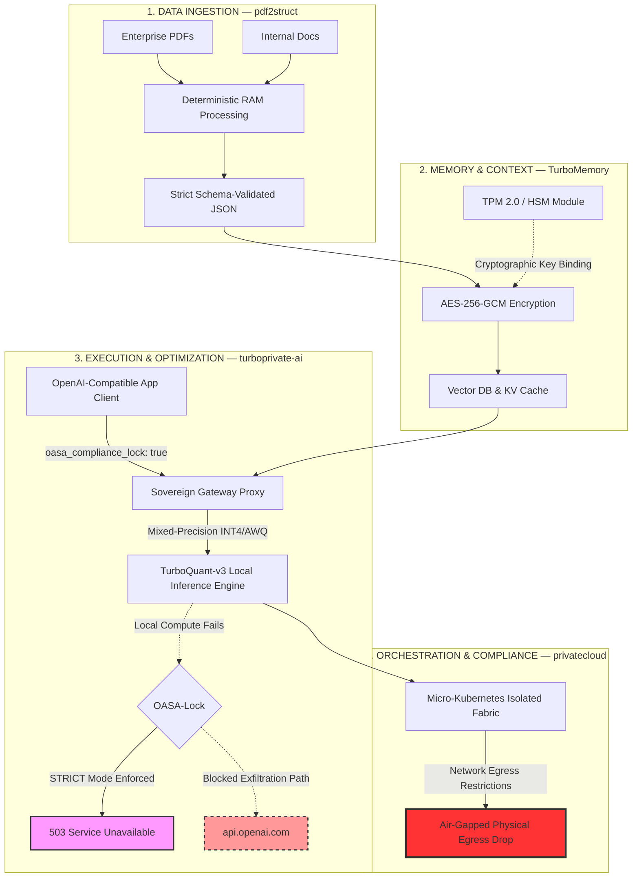

<p align="center">
  <strong>⬡ SOVEREIGN AI INFRASTRUCTURE STANDARD ⬡</strong>
</p>

<h1 align="center">SovereignStack</h1>

<p align="center">
  <em>The definitive local-first, air-gapped infrastructure standard for deploying enterprise-grade cognitive AI.</em>
</p>

<p align="center">
  <a href="CONFORMANCE.md"></a>
  <a href="CONFORMANCE.md"></a>
  <a href="CONFORMANCE.md"></a>
  <a href="https://github.com/Kubenew/SovereignStack/actions/workflows/oasa-conformance.yml"></a>
</p>

<p align="center">
  <a href="OASA.md"></a>
  <a href="LICENSE"></a>
  <a href="#compliance-auditing"></a>
  <a href="#1-click-sovereign-deployment"></a>
</p>

<p align="center">
  <strong>SovereignStack</strong> unifies deterministic document ingestion, hardware-secured vector memory, mixed-precision weight execution, and strict air-gapped orchestration into a single cohesive fabric — a drop-in, zero-exfiltration replacement for public AI cloud platforms.
</p>

---

## 🚀 1-Click Sovereign Deployment

Get a fully local, OASA-compliant, isolated stack running on your host machine in **under 2 minutes**:

```bash
curl -sSL install.sovereignstack.ai | bash
```

The installation script automatically:

1. **Detects** physical hardware accelerators (NVIDIA CUDA, Apple Metal, CPU-only).
2. **Verifies** system memory limits and local TPM 2.0 security processors.
3. **Generates** secure isolated environment configs (`.env` and `sovereign-stack.yaml`).
4. **Bootstraps** the isolated local cluster via Docker Compose on an `internal: true` secure network.

> **Manual execution:**
> ```bash
> git clone https://github.com/SovereignStack/SovereignStack.git && cd SovereignStack
> chmod +x install.sh && ./install.sh
> ```

---

## ⚖️ Why Not Cloud AI?

Deploying enterprise workloads to public cloud AI endpoints introduces **severe regulatory, financial, and operational risks**. SovereignStack is engineered to eliminate these vulnerabilities at the protocol level.

| Risk Dimension | Public Cloud AI (OpenAI, Anthropic, etc.) | SovereignStack Solution |
| :--- | :--- | :--- |
| **GDPR / HIPAA Exposure** | Prompts and context vectors cross jurisdiction boundaries, triggering massive regulatory compliance fines (up to **4% of annual global revenue** under GDPR). | **Air-Gapped Execution** — All computations and data remain bound to physical, geo-fenced sovereign nodes. Zero cross-border data flows by architectural design. |
| **Confidential Prompt Leakage** | Sensitive legal, financial, and corporate intellectual property is stored and reviewed on third-party servers with opaque retention policies. | **Zero Exfiltration** — Hardware-isolated runtime environment blocks **all** external outbound telemetry and WAN traffic. Prompts never leave the building. |
| **IP & Weight Leakage** | Internal weight updates and continuous fine-tuning leakage risk feeding proprietary assets back into shared foundation models. | **Complete Ownership** — Custom enterprise weights are stored locally, encrypted with TPM 2.0 hardware bindings. No model data leaves the sovereign boundary. |
| **Token Cost Explosion** | Dynamic API pricing structures scale exponentially with user adoption and context sizes. A single enterprise department can incur $50K+/month in API costs. | **Zero Token Costs** — Run complex enterprise-scale cognitive tasks on amortized commodity hardware with **flat, predictable cost structures**. |
| **Model Dependency & Availability** | Unannounced model deprecations, API rate-limiting, version changes, and cloud downtime disrupt core operations without warning. | **Operational Autonomy** — 100% control over local model versions, hardware allocation, and continuous runtime stability. No vendor lock-in. |
| **Audit & Compliance Trail** | Cloud providers control logging infrastructure. Audit trails are opaque, incomplete, or retained in foreign jurisdictions. | **Immutable Local Audit Logs** — All inference requests are logged locally with cryptographic tags (`oasa_audit_tag`), jurisdiction metadata, and tamper-evident timestamps. |

### Cost Comparison: Cloud vs. Sovereign

```
  Cloud API (GPT-4 class)          SovereignStack (Local 70B INT4)
  ─────────────────────────        ──────────────────────────────────
  ~$30/M input tokens              $0.00 per token (hardware amortized)
  ~$60/M output tokens             $0.00 per token
  $0 upfront, $$$$ ongoing         $5K-15K hardware, $0 ongoing
  ──────────────────────────       ──────────────────────────────────
  Year 1 (10 users): ~$120K        Year 1 (10 users): ~$12K
  Year 3 (50 users): ~$1.8M        Year 3 (50 users): ~$15K
```

---

## 🏛️ Unified Landing Architecture

SovereignStack unifies the six critical dimensions of private corporate AI into a single cohesive fabric:



> **Key Design Principle:** When local compute fails, the `oasa_compliance_lock` ensures a **503 Service Unavailable** is returned rather than silently forwarding sensitive data to external cloud APIs. A 503 is inconvenient; a GDPR fine of 4% annual revenue is catastrophic.

---

## 🔐 OASA-Lock: The Enterprise Safety Net

Every request to a Sovereign Node **must** include `"oasa_compliance_lock": true`:

```json
{
  "model": "sovereign-llama3-70b-turboquant",
  "messages": [{"role": "user", "content": "Analyze confidential audit report."}],
  "oasa_compliance_lock": true,
  "oasa_audit_tag": "AUDIT-2026-00042",
  "oasa_jurisdiction": "EU-GDPR"
}
```

The compliance lock guarantees fail-closed behavior. See [OASA Specification](OASA.md) for the complete protocol definition and [OASA-Lock Specification](schemas/oasa-lock.md) for detailed behavior.

---

## 🛠️ High-Performance Sovereign Tooling

SovereignStack includes robust, production-grade CLI utilities to calculate resource footprints, run diagnostic network audits, and profile inference performance.

### 1. VRAM & KV Cache Calculator

Estimate the exact VRAM footprint required to run target parameters, quantizations, and batch sizes **before deploying**:

```bash
python tools/vram_calculator.py --params 70B --quant INT4 --context 8192 --batch 2
```

```
============================================================
           OASA SOVEREIGN VRAM & CONTEXT ESTIMATOR
============================================================
  Model Size:          70.0 Billion parameters
  Quantization Format: INT4 (4.0-bit execution)
  Target VRAM Budget:  24.0 GB
------------------------------------------------------------
  1. Model Weights:     35.00 GB
  2. Cognitive Cache:    2.50 GB  (KV Cache)
  3. Context Execution:  2.70 GB  (Activations / CUDA overhead)
------------------------------------------------------------
  TOTAL VRAM REQUIRED:  40.20 GB
------------------------------------------------------------
  VERDICT: [FAIL] Red Zone — OOM Risk! (Shortfall: 16.2 GB)
============================================================
```

*Auto-detects physical CUDA/Metal memory capacity and maps performance into Green/Yellow/Red compliance zones.*

### 2. Compatibility & Latency Benchmarking

Run performance metrics and verify standard compatibility against the local proxy gateway:

```bash
python tools/benchmark.py --url http://localhost:8080/v1 --model sovereign-llama3
```

*Profiles Time to First Token (TTFT), token generation throughput (tokens/sec), success rates, and compliance locks.*

### 3. Active Compliance Auditor

Perform active, low-level hardware identity and network isolation diagnostics on your running host:

```bash
python tools/sovereign_stack.py validate sovereign-stack.yaml --audit-host
```

*Runs PowerShell CIM probes to audit TPM 2.0 states, queries total standalone VRAM capacity, and runs network egress socket tests.*

---

## 📐 Regulatory Compliance Matrix

SovereignStack is architected to satisfy the most stringent global regulatory frameworks:

| Regulation | Jurisdiction | OASA Coverage |
|---|---|---|
| **GDPR** | EU | Zero Exfiltration, jurisdiction routing, immutable audit logs, data residency enforcement |
| **HIPAA** | US | Encryption at rest (AES-256-GCM), air-gapped compute, access logging, BAA-compatible architecture |
| **NIS2** | EU | Hardware security modules, immutable audit trail, incident response isolation |
| **SOX** | US | Deterministic ingestion, tamper-evident logs, financial data isolation |
| **DORA** | EU | Operational resilience via air-gapped orchestration, third-party risk elimination |
| **EU AI Act** | EU | Local model control, transparency logging, human oversight preservation |

---

## 💼 Strategic Business Positioning & Commercialization

SovereignStack is built to enable robust monetization channels while satisfying corporate risk officers:

### 1. Enterprise Support Agreements (SLA)
* Professional enterprise support models (analogous to Red Hat and HashiCorp).
* Deployment audits, dedicated integration support, and custom high-availability orchestrations.
* 24/7 incident response with guaranteed SLA tiers (99.9% uptime commitment).

### 2. SovereignNode Air-Gapped Appliances
* Turnkey, hardware-secured, physical compute appliances.
* Pre-configured with hardened OS layers, K3s runtimes, local quantized model caches, encrypted Qdrant databases, and tamper-evident logging.
* Targeted directly at **governments, defense contractors, financial institutions, and medical systems**.

### 3. OASA Compliance Certification
* Verification and compliance badges ("**OASA-Certified**") for software systems and hosting vendors.
* Automates preparation for stringent regulatory audits (e.g. EU AI Act, NIS2, and HIPAA).
* Third-party auditor integration with machine-readable compliance reports.

---

## 📦 Helm Chart (Enterprise Kubernetes Deployment)

For production air-gapped deployments, SovereignStack now includes a full Helm chart with vLLM inference engine:

```bash
# Deploy the complete stack
helm install sovereign-stack ./charts/sovereignstack \
  --namespace sovereign-stack --create-namespace \
  --set vllm.model.name="Qwen/Qwen2.5-7B-Instruct" \
  --set global.air_gapped=true
```

**Chart features:** vLLM inference with PagedAttention, strict NetworkPolicies (zero egress), OPA sidecar for DLP/RBAC, gVisor sandboxing, persistent model weight volumes, and multi-GPU tensor parallelism.

## 🚀 vLLM Inference Backend

SovereignStack now defaults to **vLLM** — a high-performance inference engine with OpenAI-compatible API, continuous batching, AWQ/GPTQ/FP8 quantization, FlashAttention, and `HF_HUB_OFFLINE=1` for air-gapped operation. Try it locally:

```bash
docker compose up --build -d
curl -X POST http://localhost:8080/v1/chat/completions \
  -H "Content-Type: application/json" \
  -H "Authorization: Bearer mock-valid-token" \
  -d '{"model":"Qwen/Qwen2.5-7B-Instruct","messages":[{"role":"user","content":"Hello"}],"oasa_compliance_lock":true}'
```

## 🗺️ Roadmap

| Status | Phase | Feature | Description |
|---|---|---|---|
| ✅ | **2026.1** | **Helm Chart** | Full K8s Helm chart for enterprise air-gapped deployment |
| ✅ | **2026.1** | **vLLM Integration** | Production inference with PagedAttention, AWQ, Tensor Parallel |
| ✅ | **2026.1** | **Dynamic VRAM Scaling** | Automatic context window sizing from hardware budget |
| ✅ | **2026.1** | **OPA Policy Engine** | Enterprise DLP, prompt injection, and RBAC via sidecar |
| ✅ | **2026.1** | **CI/CD Test Matrix** | Multi-Python version, schema validation, Helm lint |
| 🚧 | **Q3 2026** | OASA Merkle-Tree Auditing | Append-only, cryptographically verified logging chains |
| 🚧 | **Q4 2026** | Secure Weight Federation | Sharded, cross-node inference without sharing weights |
| 🚧 | **Q1 2027** | Hardware Enclave Ingest | SGX/SEV-SNP confidential computing for ingestion |
| 🚧 | **Q2 2027** | OASA Telemetry Standard | Privacy-preserving performance metrics |
| 🚧 | **Q3 2027** | Secure Update Protocol | Cosign-signed model weight distribution |

---

## 📂 Project Structure

```
SovereignStack/
├── OASA.md                     # Full OASA specification
├── README.md                   # This file
├── install.sh                  # 1-Click sovereign deployment
├── docker-compose.yml          # Local isolated stack orchestration (vLLM + services)
├── sovereign-stack.yaml        # OASA node manifest
├── requirements.txt            # Python dependencies
├── charts/                     # Helm Charts for enterprise K8s deployment
│   └── sovereignstack/         # Full Helm chart with vLLM, gateway, memory, ingest
├── services/                   # Microservice implementations
│   ├── gateway_service.py      # OpenAI-compatible proxy gateway (vLLM backend)
│   ├── ingest_service.py       # pdf2struct document ingestion
│   ├── memory_service.py       # TurboMemory vector store
│   └── compute_service.py      # Legacy mock compute engine
├── tools/                      # CLI utilities
│   ├── vram_calculator.py      # VRAM budget estimation + dynamic context sizing
│   ├── benchmark.py            # Performance & compatibility suite
│   ├── sovereign_stack.py      # Unified validation & audit CLI
│   ├── runtime_shield.py       # Memory drift & exfiltration watchdog
│   └── validate_compliance.py  # Schema compliance validator
├── schemas/                    # JSON Schema definitions
├── tests/                      # Automated test suites
├── examples/                   # Integration examples (Bash, Python)
├── policies/                   # OPA Rego policy files (DLP, RBAC, safety)
├── k8s/                        # Raw Kubernetes manifests
└── playground/                 # Docker-based local playground
```

---

## 🤝 Contributing

We welcome contributions to the OASA standard and SovereignStack reference tooling. Please see our [Contributing Guidelines](CONTRIBUTING.md) to get started.

## 📄 License

SovereignStack is licensed under the Apache License, Version 2.0. See the [LICENSE](LICENSE) file for details.
