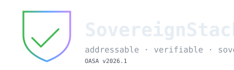
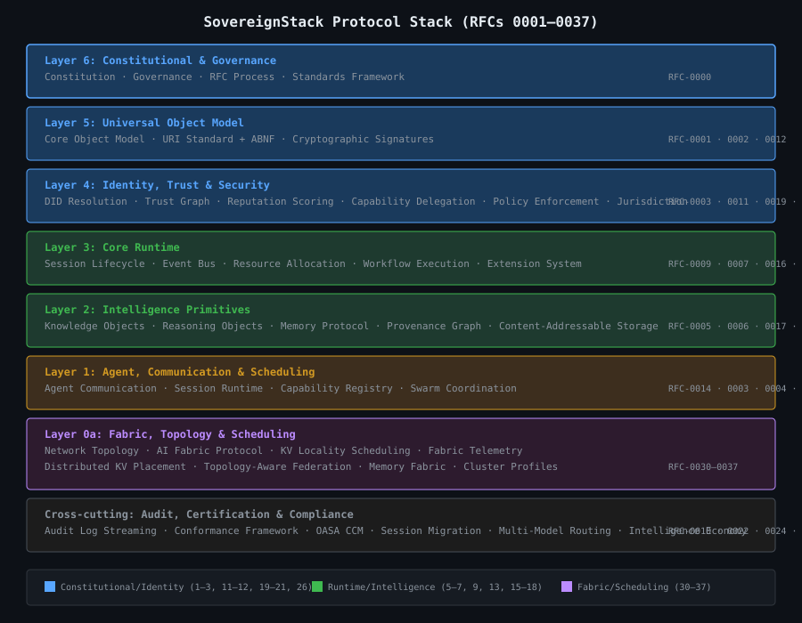
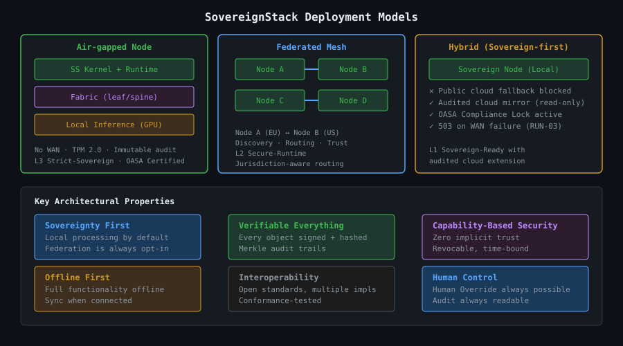
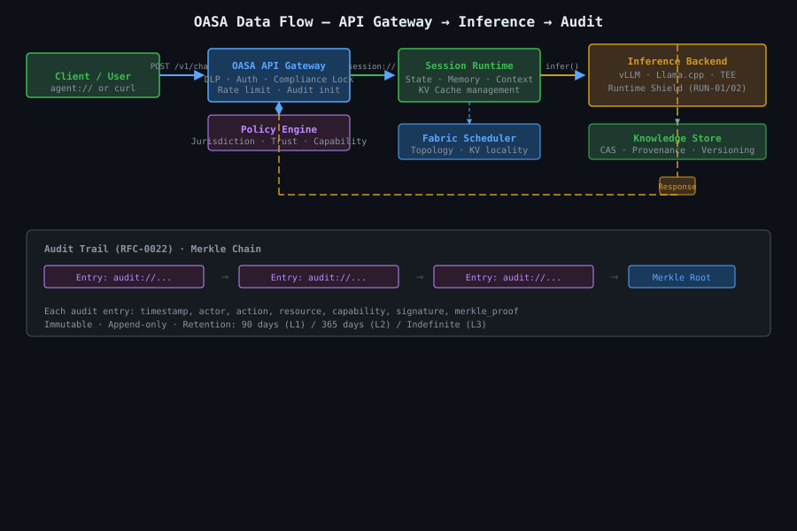

# SovereignStack

<p align="center">
  
</p>
<p align="center">
  
  
  
  
</p>
<p align="center">
  <strong>47 RFCs</strong> · <strong>77 URI schemes</strong> · <strong>19 protocols</strong> · <strong>6 Industry Profiles</strong>
</p>
<p align="center">
  <a href="/README.md">🇬🇧 English</a> ·
  <a href="docs/i18n/de/README.md">🇩🇪 Deutsch</a> ·
  <a href="docs/i18n/fr/README.md">🇫🇷 Français</a> ·
  <a href="docs/i18n/es/README.md">🇪🇸 Español</a> ·
  <a href="docs/i18n/it/README.md">🇮🇹 Italiano</a> ·
  <a href="docs/i18n/nl/README.md">🇳🇱 Nederlands</a> ·
  <a href="docs/i18n/pl/README.md">🇵🇱 Polski</a> ·
  <a href="docs/i18n/cs/README.md">🇨🇿 Čeština</a> ·
  <a href="docs/i18n/sv/README.md">🇸🇪 Svenska</a>
</p>
<p align="center">
  <a href="docs/i18n/ja/README.md">🇯🇵 日本語</a> ·
  <a href="docs/i18n/zh-CN/README.md">🇨🇳 中文</a> ·
  <a href="docs/i18n/ko/README.md">🇰🇷 한국어</a> ·
  <a href="docs/i18n/hi/README.md">🇮🇳 हिन्दी</a> ·
  <a href="docs/i18n/tr/README.md">🇹🇷 Türkçe</a> ·
  <a href="docs/i18n/ar/README.md">🇦🇪 العربية</a> ·
  <a href="docs/i18n/pt-BR/README.md">🇵🇹 Português</a> ·
  <a href="docs/i18n/ru/README.md">🇷🇺 Русский</a> ·
  <a href="docs/i18n/uk/README.md">🇺🇦 Українська</a>
</p>

---

## What is SovereignStack?

**SovereignStack is an open operating system and protocol stack for autonomous digital systems.** It combines identity, governance, provenance, policy, distributed execution, and programmable economic objects into a unified architecture for trustworthy, interoperable, and sovereign AI-powered infrastructure.

It treats intelligence, identity, and economic value as networked resources — the way Linux treats files, the way TCP/IP treats packets.

```
┌────────────────────────────────────────────────────────────────────┐
│                    WHAT SOVEREIGNSTACK PROVIDES                    │
├────────────────────────────────────────────────────────────────────┤
│                                                                    │
│  Identity Layer       Universal Agent Identity (UAI)              │
│                       DID resolution, trust, reputation           │
│                                                                    │
│  Intelligence Layer   Agents, Memory, Reasoning, Planning         │
│                       Search inference, meta-cognition             │
│                                                                    │
│  Governance Layer     Policy enforcement, jurisdiction             │
│                       ZK alignment, safety contracts               │
│                                                                    │
│  Economic Layer       Payments, markets, treasury, assets          │
│                       Tokenized finance, settlement                │
│                                                                    │
│  Digital Twin Layer   Person, company, bank, factory               │
│                       Vehicle, city, portfolio                     │
│                                                                    │
│  Fabric Layer         Federation, scheduling, networking           │
│                       Continuity, migration, recovery              │
│                                                                    │
│  Provenance Layer     Every action traceable, auditable            │
│                       Merkle audit trail, evidence chain           │
│                                                                    │
└────────────────────────────────────────────────────────────────────┘
```

**Key insight:** SovereignStack does not compete with LangChain, CrewAI, or AutoGen. Those are orchestration frameworks. SovereignStack is the **infrastructure layer** they run on — the way Kubernetes does not compete with Docker Compose.

---

> **[Read the Reference Architecture (SIRA.md) →](SIRA.md)**

---

## Repository Structure

To support both standards development and practical adoption, this repository is organized into three main categories:

1. **Standards**
   - RFCs (`rfcs/`)
   - URI Standard (`URI_STANDARD.md`)
   - Object Model (`OBJECT_MODEL.md`)
   - Protocols & Constitution (`CONSTITUTION.md`)
2. **Reference Implementations**
   - Rust crates (Core runtime, `ss-*`)
   - SDKs (`sdks/`)
   - Reference Node (`reference-node/`)
   - Examples (`examples/`)
   - Nitro runtime (`os/`)
3. **Profiles**
   - Finance (`profiles/finance/`)
   - Healthcare (`profiles/healthcare/`)
   - Government, Manufacturing, Defense

```
SovereignStack/
├── ss-kernel/        # Core kernel (identity, resolver, eventbus, registry, capability, policy)
├── ss-core/          # Shared types, URI parsing, errors
├── ss-crypto/        # Ed25519 signing, hashing
├── ss-identity/      # Universal Agent Identity
├── ss-capability/    # Capability declaration & matching
├── ss-eventbus/      # Event sourcing infrastructure
├── ss-cas/           # Content-addressed storage
├── ss-federation/    # Sovereign routing & discovery
├── ss-runtime/       # Multi-model execution runtime
├── ss-memory/        # Tiered memory subsystem (Stub)
├── ss-sessiond/      # Session lifecycle daemon
├── ss-scheduler/     # Compute placement (Stub)
├── ss-swarm/         # Multi-agent coordination (Stub)
├── ss-reason/        # Reasoning object store (Stub)
├── ss-kas/           # Knowledge addressing system (Stub)
├── ss-sig/           # Sovereign identity graph (Stub)
├── ss-trust/         # Trust framework (Stub)
├── ss-reputation/    # Reputation scoring (Stub)
├── ss-policy/        # Governance & jurisdiction (Stub)
├── ss-provenance/    # Computational lineage (Stub)
├── ss-jurisdiction/  # Jurisdiction compliance engine
├── ss-twin/          # Digital twin framework (IoT/robotics)
├── ss-device/        # Reality interface layer (Stub)
├── ss-economy/       # Financial economy primitives
├── ss-sip/           # Sovereign Intelligence Protocol (Stub)
├── ss-contracts/     # Safety contracts & human override (Stub)
├── reference-node/   # Minimal reference node binary
├── profiles/         # Industry profiles
├── conformance/      # Conformance test suites & profiles
├── rfcs/             # Protocol specifications (RFC-0001–0060)
├── docs/             # Architecture, protocol mappings, reference architectures
├── tests/            # Conformance test suite
├── examples/         # Adapters, federation, etc.
└── playground/       # Try-it-now deployment
```

---

## Quick Start (5 minutes)

```bash
# 1. Clone the repository
git clone https://github.com/Kubenew/SovereignStack.git
cd SovereignStack

# 2. Build the Rust workspace (Linux/macOS)
cargo build --release

# 2a. Build (Windows — see BUILD_WINDOWS.md for MSI guide)
cargo build --release --bin ss-node --bin ss-cli

# 3. Launch playground (Docker Compose)
docker compose -f playground/docker-compose.yml up -d

# 4. Verify nodes are running
curl http://localhost:8080/health

# 5. Run conformance tests
cargo test --workspace
python -m pytest tests/conformance/ -v

# 6. Check the audit trail
tail -f /var/log/sovereignstack/audit.log

# 7. Multi-node federation (3 jurisdictions)
docker compose -f examples/federation/docker-compose.federation.yml up -d

# 8. Inference adapters
cd examples/adapters/ollama && python adapter.py   # Ollama
cd examples/adapters/vllm   && python adapter.py   # vLLM
```

**That's it.** You now have a running SovereignStack node with identity, capabilities, event bus, and provenance logging.

See [playground/](playground/) for Docker Compose setup, [SCALING-AGI.md](SCALING-AGI.md) for production deployment, and [examples/federation/](examples/federation/) for multi-node federation.

---

### Six-Layer Architecture

```
Applications          Finance · Healthcare · Manufacturing · Government · Defense
─────────────────────────────────────────────────────────────────────────────
Economic Layer        Markets · Payments · Insurance · Treasury · Assets
─────────────────────────────────────────────────────────────────────────────
Intelligence Layer    Agents · Memory · Reasoning · Planning · Search
─────────────────────────────────────────────────────────────────────────────
Governance Layer      Policy · Identity · Capabilities · Jurisdiction · Trust
─────────────────────────────────────────────────────────────────────────────
Fabric                Federation · Scheduling · Networking · Continuity
─────────────────────────────────────────────────────────────────────────────
Kernel                Runtime · Storage · Security · Events · Provenance
```

### Where SovereignStack fits

```
Linux              (1991 — server operating system)
Kubernetes         (2014 — container orchestration)
SPIFFE             (2017 — workload identity)
OpenTelemetry      (2019 — observability)
TCP/IP             (1974 — network protocol)
SovereignStack     (2026 — operating system for autonomous digital economies)
```

## Design Principles

Every SovereignStack object is:

1. **Identifiable** — has a unique URI
2. **Addressable** — resolvable across the network
3. **Discoverable** — findable via capability/semantic search
4. **Verifiable** — cryptographically signed, with provenance
5. **Portable** — movable across nodes and jurisdictions
6. **Federatable** — shareable across sovereign boundaries
7. **Auditable** — full history and reasoning trail

## Universal Addressing

```
agent://researcher-1            # Agent identity
session://abc123                # Session
artifact://def456               # Produced artifact
memory://xyz789                 # Memory object
reason://decision-42            # Reasoning chain
knowledge://physics/newton      # Knowledge object
capability://legal-review       # Skill/capability
workflow://contract-analysis    # Workflow definition
contract://task-88              # Agent contract
org://acme                      # Organization
robot://drone-12                # Physical device
policy://gdpr-eu                # Governance policy
tel://zcube-a/evt-001           # Telemetry event (RFC-0033)
kv://zcube-a/gpu-003/session-a  # KV cache object (RFC-0034)
gateway://eu-frankfurt          # Federation gateway (RFC-0035)
mem://zcube-a/gpu-003/hbm       # Memory pool (RFC-0036)
profile://zcube-standard-v1     # Cluster profile (RFC-0037)
model://huggingface/Qwen/Qwen2.5-72B  # AI model (RFC-0040)
dataset://huggingface/c4        # Dataset (RFC-0040)
training://zcube-a/run-0042     # Training run (RFC-0040)
evaluation://zcube-a/eval-007   # Model evaluation (RFC-0040)
audit-pkg://node-001/2026-06-03 # Audit evidence package
continuity://zcube-a/legal-agent # AI continuity manifest (RFC-0052)
recovery://zcube-a/incident-42  # Recovery procedure (RFC-0050)
failover://zcube-a/evt-001      # Failover event log (RFC-0051)
playbook://zcube-a/gpu-failure  # Recovery playbook (RFC-0050)
checkpoint://cluster-a/agent-42  # Agent state checkpoint (RFC-0052)
snapshot://zcube-a/gpu-003/snap  # Memory snapshot (RFC-0036)
migration://zcube-a/gpu-003/ag   # Agent migration (RFC-0051)

# Digital Twin Objects (RFC-0060)
person://alice-j-doe             # Natural person digital twin
company://acme-corp              # Corporate entity
bank://eu-central-bank           # Financial institution
factory://munich-plant-7         # Manufacturing facility
hospital://charite-berlin        # Healthcare institution
vehicle://fleet-42/truck-009     # Autonomous vehicle
portfolio://pension-fund/balanced # Investment portfolio
fund://sovereign-wealth-no       # Investment fund
bond://de-bund-2035              # Debt instrument
asset://tokenized/berlin-01      # Tokenized real-world asset

# Financial Economy Objects
payment://swift/pacs008-001      # Payment instruction
settlement://dvp/trade-88421    # Settlement record
treasury://acme/main-usd        # Treasury account
derivative://swap/irs-42         # Derivative contract
insurance://policy/auto-fleet    # Insurance policy
account://acme/gl/1000-assets   # Ledger account
tax://de/vat/evt-20260723       # Taxable event
```

## Architecture

<p align="center">
  
  <br><em>SovereignStack Protocol Stack — RFCs organized by layer</em>
</p>

<p align="center">
  
  <br><em>Deployment Models: Air-gapped · Federated Mesh · Hybrid</em>
</p>

<p align="center">
  
  <br><em>OASA Data Flow — API Gateway → Inference → Audit Trail</em>
</p>

```
ss-kernel
 ├── Identity        (UAI, SIG, trust, reputation)
 ├── Capabilities    (registry, discovery, routing)
 ├── Messaging       (event bus, streams)
 ├── Memory          (tiered: session → civilizational)
 ├── Scheduling      (compute placement, model selection)
 ├── Federation      (sovereign routing, replication)
 ├── Governance      (policies, jurisdiction, compliance)
 └── Provenance      (lineage, evidence, audit)
```

## Core Features & Services

Alongside the core Rust primitives, SovereignStack implements a suite of Python-based microservices providing production-ready infrastructure:

- **OASA API Gateway**: Secure, OpenAI-compatible entry point enforcing Data Loss Prevention (DLP), Strict Compliance Locking, and SPIFFE workload identity validation.
- **Federation Relay & Sync Engine**: Decentralized node synchronization utilizing advanced Conflict-Free Replicated Data Types (CRDTs) to ensure eventual consistency across sovereign boundaries.
- **Merkle Audit Log**: Cryptographically verifiable, append-only event stream providing a tamper-proof provenance trail for all system operations.
- **Predictive Scheduler**: Autonomous operational controller employing exponential smoothing models to predict compute load and proactively scale resources.
- **Weight Federation**: Secure registration and sharding of model weights across distributed nodes for collaborative inference.


## Standards Ecosystem

SovereignStack is governed by a formal standards framework:

| Document | Description |
|---|---|
| [STANDARDS.md](STANDARDS.md) | Root standards framework — 6 layers |
| [OBJECT_MODEL.md](OBJECT_MODEL.md) | Universal object model with cryptographic signatures |
| [URI_STANDARD.md](URI_STANDARD.md) | URI scheme registry & resolution rules |
| [TRUST_MODEL.md](TRUST_MODEL.md) | Capability-based zero-trust security |
| [SECURITY.md](SECURITY.md) | Threat model & incident response |
| [CONFORMANCE.md](CONFORMANCE.md) | 3-tier certification program & badges |
| [CERTIFICATION.md](CERTIFICATION.md) | Badge levels, colors, shapes, materials |
| [PROTOCOL_REGISTRY.md](PROTOCOL_REGISTRY.md) | 18 protocols with lifecycle management |
| [examples/federation/](examples/federation/) | Multi-node federation example (3 jurisdictions) |
| [examples/adapters/](examples/adapters/) | Ollama + vLLM inference adapters |
| [conformance/](conformance/) | Conformance test suites (L1-L4) |
| [conformance/level-4-agi/](conformance/level-4-agi/) | L4 Autonomous Intelligence Ready spec |
| [REFERENCE_IMPLEMENTATIONS.md](REFERENCE_IMPLEMENTATIONS.md) | 13 core subsystems + 3 language bindings |
| [ROADMAP-2035.md](ROADMAP-2035.md) | 10-year vision through Sovereign Intelligence Internet |
| [SIRA.md](SIRA.md) | Sovereign Intelligence Reference Architecture (4-quadrant object model) |
| [SCALING-AGI.md](SCALING-AGI.md) | Production scaling guide for frontier & AGI-ready deployments |
| [BUILD_WINDOWS.md](BUILD_WINDOWS.md) | Windows build guide — exe, MSI, Python bundling |
| [docs/i18n/README.md](docs/i18n/README.md) | Internationalization — 18 languages with full i18n policy |

### Internationalization

SovereignStack is translated into 18 languages. The project follows the Debian model: **English is canonical**, translations are maintained copies. See the [i18n index](docs/i18n/README.md) for available languages and the translation policy.

### RFCs

| RFC | Title | Status |
|---|---|---|
| [RFC-0001](rfcs/RFC-0001-core-object-model.md) | Sovereign Object Model | Draft |
| [RFC-0002](rfcs/RFC-0002-uri-resolution.md) | URI Standard + ABNF Grammar | Draft |
| [RFC-0003](rfcs/RFC-0003-session-runtime.md) | Trust Graph | Draft |
| [RFC-0004](rfcs/RFC-0004-capability-registry.md) | Capability Registry | Draft |
| [RFC-0005](rfcs/RFC-0005-knowledge-objects.md) | Knowledge Objects | Draft |
| [RFC-0006](rfcs/RFC-0006-reasoning-objects.md) | Reasoning Objects | Draft |
| [RFC-0007](rfcs/RFC-0007-event-bus.md) | Event Bus | Draft |
| [RFC-0008](rfcs/RFC-0008-federation-routing.md) | Federation Routing | Draft |
| [RFC-0009](rfcs/RFC-0009-session-lifecycle.md) | Session Lifecycle | Draft |
| [RFC-0010](rfcs/RFC-0010-conformance-framework.md) | Conformance Framework | Draft |
| [RFC-0011](rfcs/RFC-0011-identity-did-resolution.md) | Identity & DID Resolution | Draft |
| [RFC-0012](rfcs/RFC-0012-cryptographic-signatures.md) | Cryptographic Signatures & Verification | Draft |
| [RFC-0013](rfcs/RFC-0013-provenance-graph.md) | Provenance Graph | Draft |
| [RFC-0014](rfcs/RFC-0014-agent-communication.md) | Agent Communication Protocol | Draft |
| [RFC-0015](rfcs/RFC-0015-workflow-execution.md) | Workflow Execution Engine | Draft |
| [RFC-0016](rfcs/RFC-0016-resource-allocation.md) | Resource Allocation & Accounting | Draft |
| [RFC-0017](rfcs/RFC-0017-sovereign-memory-protocol.md) | Sovereign Memory Protocol (Detailed) | Draft |
| [RFC-0018](rfcs/RFC-0018-content-addressed-storage.md) | Content-Addressable Storage | Draft |
| [RFC-0019](rfcs/RFC-0019-trust-reputation-scoring.md) | Trust & Reputation Scoring | Draft |
| [RFC-0020](rfcs/RFC-0020-policy-enforcement.md) | Policy Enforcement | Draft |
| [RFC-0021](rfcs/RFC-0021-jurisdiction-data-residency.md) | Jurisdiction & Data Residency | Draft |
| [RFC-0022](rfcs/RFC-0022-audit-log-streaming.md) | Audit Log Streaming | Draft |
| [RFC-0023](rfcs/RFC-0023-extension-plugin-system.md) | Extension & Plugin System | Draft |
| [RFC-0024](rfcs/RFC-0024-multi-model-routing.md) | Multi-Model Routing | Draft |
| [RFC-0025](rfcs/RFC-0025-session-migration.md) | Session Migration | Draft |
| [RFC-0026](rfcs/RFC-0026-capability-delegation.md) | Capability Delegation Chain | Draft |
| [RFC-0027](rfcs/RFC-0027-swarm-coordination.md) | Swarm Coordination | Draft |
| [RFC-0028](rfcs/RFC-0028-digital-twin-sync.md) | Digital Twin Synchronization | Draft |
| [RFC-0029](rfcs/RFC-0029-intelligence-economy.md) | Intelligence Economy Primitives | Draft |
| [RFC-0030](rfcs/RFC-0030-network-topology-awareness.md) | Network Topology Awareness | Draft |
| [RFC-0031](rfcs/RFC-0031-kv-locality-scheduling.md) | KV Locality Scheduling | Draft |
| [RFC-0032](rfcs/RFC-0032-ai-fabric-protocol.md) | AI Fabric Protocol | Draft |
| [RFC-0033](rfcs/RFC-0033-fabric-telemetry.md) | Fabric Telemetry Protocol | Draft |
| [RFC-0034](rfcs/RFC-0034-distributed-kv-placement.md) | Distributed KV Placement | Draft |
| [RFC-0035](rfcs/RFC-0035-topology-aware-federation.md) | Topology-Aware Federation | Draft |
| [RFC-0036](rfcs/RFC-0036-memory-fabric-objects.md) | Memory Fabric Objects | Draft |
| [RFC-0037](rfcs/RFC-0037-ai-cluster-profiles.md) | AI Cluster Profiles | Draft |
| [RFC-0040](rfcs/RFC-0040-model-lineage-protocol.md) | Model Lineage Protocol | Draft |
| [RFC-0050](rfcs/RFC-0050-ai-continuity-disaster-recovery.md) | AI Continuity & Disaster Recovery | Draft |
| [RFC-0051](rfcs/RFC-0051-model-failover-protocol.md) | Model Failover Protocol | Draft |
| [RFC-0052](rfcs/RFC-0052-ai-continuity-manifest.md) | AI Continuity Manifest | Draft |
| [RFC-0053](rfcs/RFC-0053-sovereign-recovery-profiles.md) | Sovereign Recovery Profiles | Draft |
| [RFC-0056](rfcs/RFC-0056-search-inference.md) | Search Inference | Draft |
| [RFC-0057](rfcs/RFC-0057-metacognition.md) | Meta-Cognition | Draft |
| [RFC-0060](rfcs/RFC-0060-digital-twin-entity-model.md) | Digital Twin Entity Model | Draft |
| [RFC-0061](rfcs/RFC-0061-human-override.md) | Human Override Protocol | Draft |


## v0.4.0 — Reference & Conformance

The reference implementation with conformance testing, multi-node federation, and inference adapters.

**What's new:**

- **Conformance suite**: Automated L1-L4 testing with CI integration (GitHub Actions)
- **Multi-node federation**: 3-jurisdiction example (EU/US/Asia) with CRDT sync
- **Inference adapters**: Ollama and vLLM bridges with audit logging
- **L4 certification**: "Autonomous Intelligence Ready" — meta-cognition, safety contracts, human override, search audit
- **RFCs 0045-0074**: Meta-cognition, safety contracts, search objects, digital economy, digital twins
- **77 URI schemes**: Complete addressing for agents, twins, finance, and cognitive processes
- **Digital economy primitives**: Payments, markets, treasury, derivatives, insurance, settlement

**Quick links:**

| Resource | Description |
|----------|-------------|
| [SIRA.md](SIRA.md) | Reference Architecture |
| [conformance/](conformance/) | Conformance test suites (L1-L4) |
| [examples/federation/](examples/federation/) | Multi-node federation |
| [examples/adapters/](examples/adapters/) | Ollama + vLLM adapters |
| [level-4-agi/](conformance/level-4-agi/) | L4 certification spec |
| [rfcs/](rfcs/) | 47 protocol specifications |

## Compliance & Certifications

SovereignStack provides a complete audit and certification framework for enterprise AI deployments:

| Asset | Description |
|-------|-------------|
| [OASA CCM](compliance/oasa-ccm.md) | Core Controls Matrix — 18 controls across NET/RUN/HW/AUD/CONT for L1/L2/L3 |
| [SOC 2 Mapping](compliance/soc2-mapping.md) | Full mapping to AICPA TSC 2023 — all 5 trust categories |
| [Gaia-X Mapping](compliance/gaia-x-mapping.md) | Mapping to Gaia-X Trust Framework + Self-Description generation |
| [SOC 2 Type 1 Report Template](compliance/soc2-type1-report-template.json) | Pre-built evidence package template for auditor review |
| [Compliance Schema](schemas/oasa-compliance.schema.json) | JSON Schema (Draft 2020-12) for automated node validation |
| [Audit Evidence Schema](schemas/oasa-audit-evidence.schema.json) | Structured evidence package for `oasa-audit report` |
| [Validation Script](tools/validate_compliance.py) | Automated compliance scanner with `--audit-host` |

**Target frameworks**: ISO 42001, EU AI Act, SOC 2, NIS2, Gaia-X, CSA CCM, FedRAMP

```bash
# Generate compliance evidence package
oasa-audit report --framework iso42001 --framework soc2

# Export for auditor review
oasa-audit export-pdf --output audit-report-2026-Q2.pdf
```

## License

Apache-2.0 OR MIT (dual-licensed)
