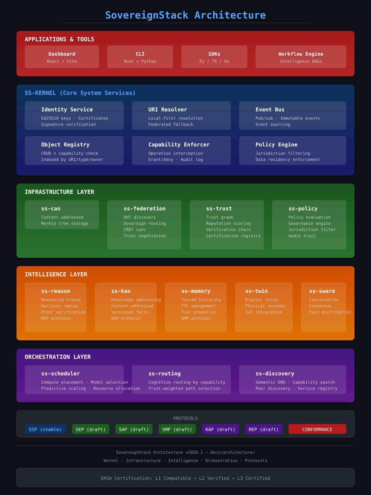

# SovereignStack

<p align="center">
  
  
  
  
  
</p>

> **The Sovereign Intelligence Network** — A distributed operating system for intelligence.

[](docs/architecture/00-overview.md)

SovereignStack is a protocol stack and runtime that treats intelligence itself as a networked resource. It is to autonomous intelligence what TCP/IP is to data networking.

```
1970s → ARPANET          (packet switching)
1990s → Internet         (global connectivity)
2000s → Cloud            (elastic compute)
2020s → AI Platforms     (model serving)
2030s → Sovereign Intelligence Networks (SovereignStack)
```

## Design Principles

Every SovereignStack object is:

1. **Identifiable** — has a unique URI
2. **Addressable** — resolvable across the network
3. **Discoverable** — findable via capability/semantic search
4. **Verifiable** — cryptographically signed, with provenance
5. **Portable** — movable across nodes and jurisdictions
6. **Federatable** — shareable across sovereign boundaries
7. **Auditable** — full history and reasoning trail

## Universal Addressing

```
agent://researcher-1            # Agent identity
session://abc123                # Session
artifact://def456               # Produced artifact
memory://xyz789                 # Memory object
reason://decision-42            # Reasoning chain
knowledge://physics/newton      # Knowledge object
capability://legal-review       # Skill/capability
workflow://contract-analysis    # Workflow definition
contract://task-88              # Agent contract
org://acme                      # Organization
robot://drone-12                # Physical device
policy://gdpr-eu                # Governance policy
```

## Architecture

```
ss-kernel
 ├── Identity        (UAI, SIG, trust, reputation)
 ├── Capabilities    (registry, discovery, routing)
 ├── Messaging       (event bus, streams)
 ├── Memory          (tiered: session → civilizational)
 ├── Scheduling      (compute placement, model selection)
 ├── Federation      (sovereign routing, replication)
 ├── Governance      (policies, jurisdiction, compliance)
 └── Provenance      (lineage, evidence, audit)
```

## Core Features & Services

Alongside the core Rust primitives, SovereignStack implements a suite of Python-based microservices providing production-ready infrastructure:

- **OASA API Gateway**: Secure, OpenAI-compatible entry point enforcing Data Loss Prevention (DLP), Strict Compliance Locking, and SPIFFE workload identity validation.
- **Federation Relay & Sync Engine**: Decentralized node synchronization utilizing advanced Conflict-Free Replicated Data Types (CRDTs) to ensure eventual consistency across sovereign boundaries.
- **Merkle Audit Log**: Cryptographically verifiable, append-only event stream providing a tamper-proof provenance trail for all system operations.
- **Predictive Scheduler**: Autonomous operational controller employing exponential smoothing models to predict compute load and proactively scale resources.
- **Weight Federation**: Secure registration and sharding of model weights across distributed nodes for collaborative inference.

## Repository Structure

```
SovereignStack/
├── ss-kernel/        # Core kernel (identity, resolver, eventbus, registry, capability, policy)
├── ss-core/          # Shared types, URI parsing, errors
├── ss-crypto/        # Ed25519 signing, hashing
├── ss-identity/      # Universal Agent Identity
├── ss-capability/    # Capability declaration & matching
├── ss-eventbus/      # Event sourcing infrastructure
├── ss-cas/           # Content-addressed storage
├── ss-federation/    # Sovereign routing & discovery
├── ss-runtime/       # Multi-model execution runtime
├── ss-memory/        # Tiered memory subsystem (Planned)
├── ss-sessiond/      # Session lifecycle daemon
├── ss-scheduler/     # Compute placement (Planned)
├── ss-swarm/         # Multi-agent coordination (Planned)
├── ss-reason/        # Reasoning object store (Planned)
├── ss-kas/           # Knowledge addressing system (Planned)
├── ss-sig/           # Sovereign identity graph (Planned)
├── ss-trust/         # Trust framework (Planned)
├── ss-reputation/    # Reputation scoring (Planned)
├── ss-policy/        # Governance & jurisdiction (Planned)
├── ss-provenance/    # Computational lineage (Planned)
├── ss-twin/          # Digital twin framework
├── ss-device/        # Reality interface layer (Planned)
├── ss-economy/       # Resource markets (Planned)
├── ss-sip/           # Sovereign Intelligence Protocol (Planned)
├── reference-node/   # Minimal reference node binary
├── conformance/      # Conformance test suites & profiles
├── rfcs/             # Protocol specifications (RFC-0001–0010)
├── docs/
│   ├── architecture/ # 10-page architecture breakdown
│   └── architecture/diagrams/ # SVG architecture diagrams
├── tests/            # Conformance test suite
├── examples/         # Reference implementations
└── playground/       # Try-it-now deployment
```

## Standards Ecosystem

SovereignStack is governed by a formal standards framework:

| Document | Description |
|---|---|
| [STANDARDS.md](STANDARDS.md) | Root standards framework — 6 layers |
| [OBJECT_MODEL.md](OBJECT_MODEL.md) | Universal object model with cryptographic signatures |
| [URI_STANDARD.md](URI_STANDARD.md) | URI scheme registry & resolution rules |
| [TRUST_MODEL.md](TRUST_MODEL.md) | Capability-based zero-trust security |
| [SECURITY.md](SECURITY.md) | Threat model & incident response |
| [CONFORMANCE.md](CONFORMANCE.md) | 3-tier certification program & badges |
| [CERTIFICATION.md](CERTIFICATION.md) | Badge levels, colors, shapes, materials |
| [PROTOCOL_REGISTRY.md](PROTOCOL_REGISTRY.md) | 7 protocols with lifecycle management |
| [REFERENCE_IMPLEMENTATIONS.md](REFERENCE_IMPLEMENTATIONS.md) | 13 core subsystems + 3 language bindings |
| [ROADMAP-2035.md](ROADMAP-2035.md) | 10-year vision through Sovereign Intelligence Internet |

### RFCs

| RFC | Title | Status |
|---|---|---|
| [RFC-0001](rfcs/RFC-0001-core-object-model.md) | Sovereign Object Model | Draft |
| [RFC-0002](rfcs/RFC-0002-uri-resolution.md) | URI Standard + ABNF Grammar | Draft |
| [RFC-0003](rfcs/RFC-0003-session-runtime.md) | Trust Graph | Draft |
| [RFC-0004](rfcs/RFC-0004-capability-registry.md) | Capability Registry | Draft |
| [RFC-0005](rfcs/RFC-0005-knowledge-objects.md) | Knowledge Objects | Draft |
| [RFC-0006](rfcs/RFC-0006-reasoning-objects.md) | Reasoning Objects | Draft |
| [RFC-0007](rfcs/RFC-0007-event-bus.md) | Event Bus | Draft |
| [RFC-0008](rfcs/RFC-0008-federation-routing.md) | Federation Routing | Draft |
| [RFC-0009](rfcs/RFC-0009-session-lifecycle.md) | Session Lifecycle | Draft |
| [RFC-0010](rfcs/RFC-0010-conformance-framework.md) | Conformance Framework | Draft |
| [RFC-0030](rfcs/RFC-0030-network-topology-awareness.md) | Network Topology Awareness | Draft |

## Getting Started

### Prerequisites

- [Rust](https://rustup.rs/) 1.75+
- Git

### Build

```bash
cargo build --workspace
```

### Test

```bash
cargo test --workspace
```

## License

Apache-2.0 OR MIT (dual-licensed)
