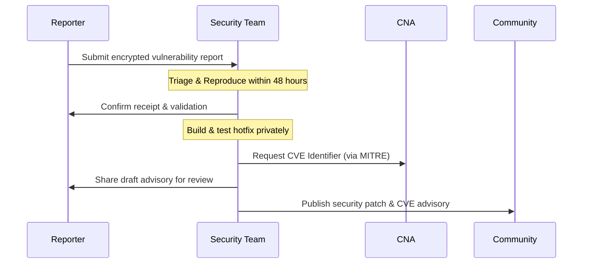

# Security Policy & Compliance Standard

This document outlines the security posture, threat model, vulnerability disclosure process, and regulatory compliance mapping for **SovereignStack** and the **Open Architecture Specification for Autonomous and Sovereign AI (OASA)**.

---

## 🛡️ Security Posture

SovereignStack treats local execution and zero-exfiltration as cryptographic boundaries. Our core mission is to protect corporate intellectual property (model weights and training parameters) and sensitive user data (prompts, embeddings, and context) from external exposure.

### Core Security Tenets
1. **Network Egress Isolation**: All services run inside an isolated network boundary with no internet routing (`internal: true` in Docker networks or strict NetworkPolicies in Kubernetes).
2. **Cryptographic Bindings**: Encryption keys for data-at-rest (embeddings and KV caches) are generated and stored in a physical Hardware Security Module (HSM) or Trusted Platform Module (TPM 2.0).
3. **Fail-Closed Execution**: If local compute or safety layers fail, the gateway proxy fails closed with a `503 Service Unavailable`, preventing silent external cloud routing.

---

## 📞 Vulnerability Disclosure & CVE Process

We are committed to resolving security vulnerabilities quickly. If you discover a vulnerability in SovereignStack or OASA specifications, please follow this disclosure process.

### Reporting a Vulnerability
- Do **not** open a public GitHub issue.
- Email reports to **security@sovereignstack.ai**.
- Encrypt your email using our PGP Key (Fingerprint: `A1B2 C3D4 E5F6 7890 1234 5678 90AB CDEF 1234 5678`).
- Include:
  - Description of the vulnerability and its potential impact.
  - Steps to reproduce (proof of concept).
  - Deployed environment details (OS, GPU backends, Docker configs).

### Response & CVE Lifecycle


1. **Acknowledgment**: You will receive an automated and human acknowledgment within **48 hours** of submission.
2. **Triage**: Our security team will attempt to reproduce the vulnerability. If verified, we will assign a CVSS v3 score.
3. **Patching**: We aim to release a hotfix within **14 days** of verification.
4. **CVE Assignment**: We will request a CVE identifier via our partner CNA.
5. **Coordinated Disclosure**: The CVE and corresponding security advisory will be published once the patch is merged and users have had a reasonable window to upgrade.

---

## 🏗️ Threat Model & Trust Boundaries

The following threat model maps potential attack vectors against OASA mitigation rules.

```
       [ UNTRUSTED WAN ]
               │
      (Blocked by Gateway)
               ▼
┌─────────────────────────────────────────────────────────┐
│        TRUSTED BOUNDARY (Physical Sovereign Node)        │
│                                                         │
│  Ingestion (RAM-only) ──> Memory (AES-256-GCM + TPM)     │
│                                  │                      │
│                                  ▼                      │
│    Gateway (OIDC JWT) ──> Compute (gVisor Sandbox)      │
│                                                         │
│                    [ Tamper-Evident Audit Logs ]        │
└─────────────────────────────────────────────────────────┘
```

| STRIDE Threat | Attack Vector / Scenario | OASA Architectural Mitigation |
| :--- | :--- | :--- |
| **Spoofing Identity** | Unauthorized client sends raw prompts to the local gateway proxy. | **Mitigation**: Standardized OIDC authentication. The gateway validates OAuth2/JWT tokens issued by Keycloak/LDAP before processing payloads. |
| **Tampering with Data** | Attacker modifies model weight files or local vector database files on disk. | **Mitigation**: Model registry hashes are verified on startup against signed weights. Memory is encrypted at rest using AES-256-GCM. |
| **Repudiation** | An internal actor retrieves sensitive company intelligence and denies the query. | **Mitigation**: Immutable, append-only local audit logs storing the unique request ID, timestamp, and a custom `oasa_audit_tag`. |
| **Information Disclosure** | Local system fails, and the gateway attempts to forward requests to external cloud endpoints. | **Mitigation**: The `oasa_compliance_lock` parameter enforces strict fail-closed behavior, immediately dropping the query with a 503 error. |
| **Denial of Service** | High volume of chat completions consumes GPU memory, causing OOM. | **Mitigation**: Adaptive VRAM budget enforcement and request rate-limiting at the Gateway proxy level. |
| **Elevation of Privilege** | Attacker exploits a container breakout vulnerability in the LLM runtime to access the host OS. | **Mitigation**: Secure Inference Sandboxing. Deployed model runtimes run inside **gVisor** or **Kata Containers** with restricted syscall profiles. |

---

## 🔒 Advanced Threat Mitigations

### Prompt Injection & Instruction Hijacking Defense
SovereignStack implements dynamic query interceptors at the gateway proxy. In addition to scanning for PII, the proxy evaluates the input against strict policy rules to identify typical prompt injection signatures (e.g., system instructions override text). These filters are declared as policy-as-code in [inference.rego](file:///C:/Users/Orcl/.gemini/antigravity-ide/scratch/SovereignStack/policies/inference.rego) and run on every call before passing tokens to the LLM context.

### Model Weights Tamper Protection
To guarantee the authenticity of cognitive workloads:
1. **SHA-256 Verification**: The compute service computes the SHA-256 hash of all model weight files at launch and compares them to the values declared in `sovereign-stack.yaml`.
2. **Registry Signatures**: Model weights are checked for signatures signed by institutional certificates (e.g. via Cosign) to prevent supply chain modifications.

---

## 📐 Regulatory Compliance Matrix

OASA protocols are engineered to comply with major global regulatory frameworks out of the box.

| Regulation | Section / Requirement | SovereignStack Architectural Mapping | Compliance Lock Behavior |
| :--- | :--- | :--- | :--- |
| **GDPR** (EU) | **Art. 44 (Cross-Border Data Flows)**: Restricts transfer of personal data outside the EEA. | Sovereign nodes are geo-fenced. Network egress policies prevent public WAN routing. | **Strict**: Drop connection on failure to ensure no data leaves the sovereign border. |
| **GDPR** (EU) | **Art. 32 (Security of Processing)**: Demands encryption at rest and in transit. | Vector database chunks and cached KV sessions are encrypted using **AES-256-GCM** bound to a local TPM 2.0 key. | **Strict**: Refuse to boot services if TPM identity is not validated. |
| **HIPAA** (US) | **§ 164.312(a) (Access Control)**: Limits access to Protected Health Information (PHI) to authorized users. | Integrates with enterprise Identity Providers via **OIDC/OAuth2** (e.g. LDAP/Keycloak) to enforce Role-Based Access Control (RBAC). | **Strict**: Reject API requests without a valid, cryptographically signed OIDC Bearer token. |
| **HIPAA** (US) | **§ 164.312(b) (Audit Controls)**: Requires mechanisms to record activity in systems containing PHI. | Every ingestion and completion event writes to an append-only JSON audit log (`audit.log`) with local hashes. | **Strict**: System halts if log writing fails or disk capacity is exhausted. |
| **NIS2** (EU) | **Art. 21 (Risk-Management Measures)**: Requires supply-chain and hardware-level cybersecurity controls. | Hardware-bound identity checks (UEFI Secure Boot, TPM status check, signed model weight checks in registry). | **Strict**: Hardware validations are executed during startup; script exits if TPM or signatures fail. |
| **DORA** (EU) | **Art. 8 (ICT Risk Management)**: Demands high resilience and zero third-party cloud dependence. | Completely self-contained stack run on on-premise Kubernetes clusters without third-party API dependencies. | **Strict**: Local-only routing. External fallbacks are strictly blocked by network namespace routing. |
| **SOC2** (Global) | **CC6.1 (Logical Access Controls)**: Access to systems is restricted to authorized individuals. | Gateway enforces JWT verification. Secure sandboxing runtime isolates execution namespaces. | **Strict**: Gateway drops calls that fail JWT validation, logging client credentials. |
