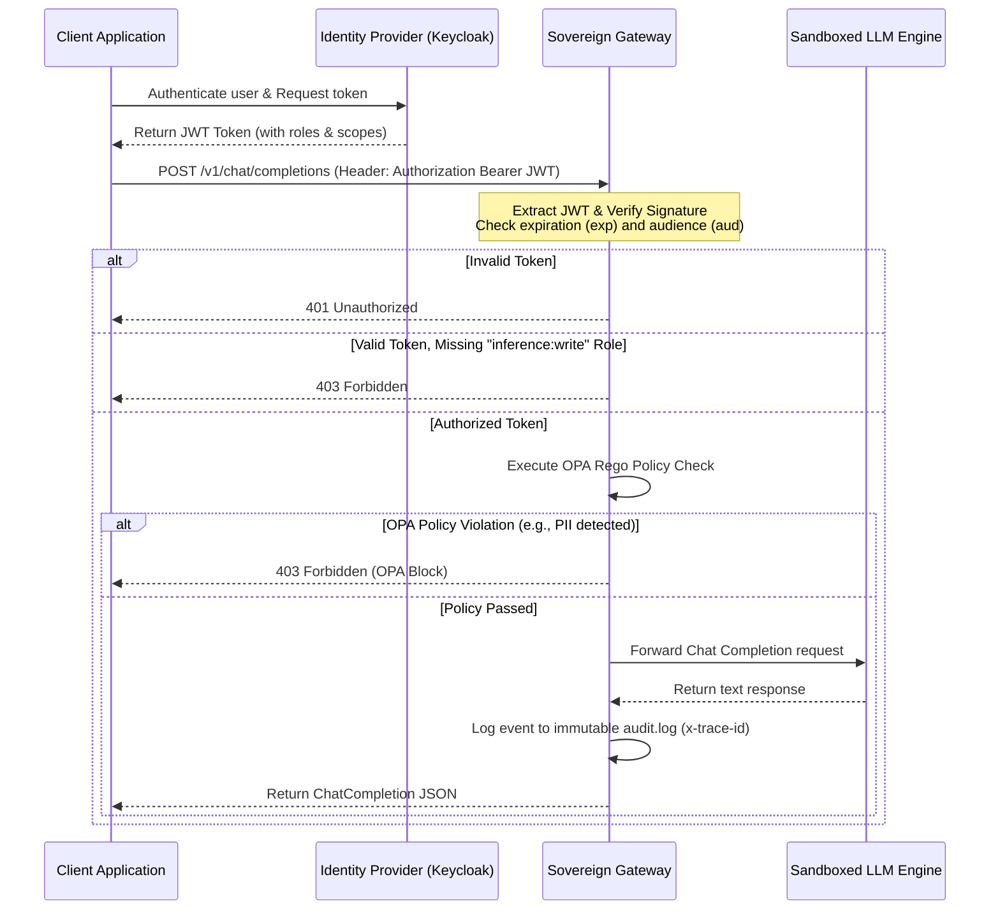

# SovereignStack Architecture Guide

This guide details the technical architecture, data flow paths, trust boundaries, and operational components of **SovereignStack**, aligning with the **Open Architecture Specification for Autonomous and Sovereign AI (OASA)**.

---

## 1. Trust Boundaries & Data Zones

A Sovereign Stack node divides resources into strict data zones based on confidentiality, network access, and compute capabilities.

```
       [ Client Request ]
               │
               ▼
┌─────────────────────────────────────────────────────────────┐
│ 1. INGRESS & GATEWAY ZONE (OIDC Validation)                 │
│    - Authenticates client JWT tokens via Keycloak/LDAP      │
│    - Evaluates OPA Policy Rules (PII / SSN / Prompt Injection)│
└──────────────┬──────────────────────────────────────────────┘
               │ (Authorized Payload)
               ▼
┌─────────────────────────────────────────────────────────────┐
│ 2. SECURE COMPUTE SANDBOX (gVisor / Kata)                   │
│    - Hypervisor-isolated runtime (runsc namespace)          │
│    - Executes quantized model weights (INT4 AWQ)            │
└──────────────┬───────────────────────┬──────────────────────┘
               │ (Read Vectors)        │ (Write logs)
               ▼                       ▼
┌─────────────────────────────┐ ┌─────────────────────────────┐
│ 3. ENCRYPTED STORAGE ZONE    │ │ 4. IMMUTABLE AUDIT ZONE     │
│    - AES-256-GCM vector DB   │ │    - Local append-only log  │
│    - TPM 2.0 bound secrets   │ │    - Cryptographic hash tags│
└─────────────────────────────┘ └─────────────────────────────┘
```

### 1.1 Ingress & Gateway Zone
- **Security Profile**: Handles external connectivity to authorized clients.
- **Data Lifecycle**: Volatile only. Requests are processed in-memory and immediately passed or rejected.
- **Controls**: OpenID Connect (OIDC) JWT validation, OpenPolicyAgent (OPA) Rego policy check.

### 1.2 Secure Compute Sandbox
- **Security Profile**: Completely isolated from the host network. High VRAM compute access.
- **Data Lifecycle**: Weight parameters are locked in GPU memory. Intermediate activations are discarded post-inference.
- **Controls**: Runs inside `gVisor` (syscall interceptor) or `Kata Containers` (micro-VM), denying direct host device access.

### 1.3 Encrypted Storage Zone
- **Security Profile**: Persistent local disk storage with zero cloud backup.
- **Data Lifecycle**: Stores vector embeddings and raw document structures.
- **Controls**: AES-256-GCM disk encryption with keys bound to the physical node's Trusted Platform Module (TPM 2.0).

### 1.4 Immutable Audit Zone
- **Security Profile**: Append-only local storage.
- **Data Lifecycle**: Persistent logs mapping request metadata, execution time, and compliance locks.
- **Controls**: Local write-once-read-many (WORM) storage mechanics, with trace IDs propagated from the Gateway proxy.

---

## 2. Identity & Access Flow (OIDC + RBAC)

SovereignStack enforces authentication at the API gateway prior to dispatching queries to the compute sandboxes. 

### Sequence Diagram


---

## 3. Policy-as-Code Engine (OPA Integration)

To prevent data exfiltration and intellectual property leakage, SovereignStack embeds **Open Policy Agent (OPA)** directly into the gateway loop.

### 3.1 Data Loss Prevention (DLP)
Prompts are scanned against predefined Rego policies. If a prompt matches patterns like credit card numbers or Social Security Numbers, the query is aborted before it reaches the model execution layer.

### 3.2 Model Visibility Limits
Different departments or roles have access to specific model budgets. For example, a standard employee role may only query an `8B` param model, while a senior analyst may access the `70B` or `123B` models.

---

## 4. Secure Workload Sandboxing

Executing LLMs requires executing complex matrix kernels and unverified python/C++ libraries. To mitigate container escape vulnerabilities, SovereignStack relies on hardened runtimes:

1. **gVisor (`runsc`)**:
   - Intercepts all system calls from the container.
   - Implements a user-space kernel (Sentry) that filters and handles calls safely, preventing raw access to the host Linux kernel.
2. **Kata Containers**:
   - Boots a lightweight micro-VM for each container.
   - Provides strict hardware-level isolation while retaining OCI compliance.
