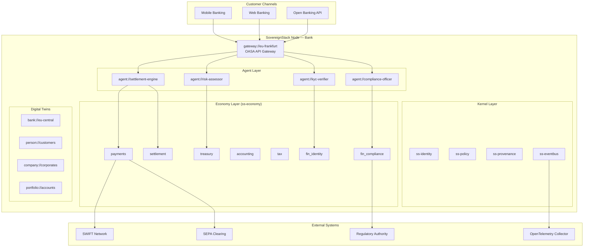

# Reference Architecture: Banking

**Version:** 1.0  
**Status:** Draft  
**Profile:** [Sovereign Finance Profile (SFIN)](../../profiles/finance/profile.yaml)

---

## Overview

This reference architecture describes how SovereignStack deploys in a core banking environment, integrating payment processing, treasury management, settlement, and regulatory reporting under a sovereign, auditable framework.

---

## Architecture Diagram

---

## Component Mapping

| Banking Domain | SovereignStack Component | URI Scheme |
|---|---|---|
| Customer identity | `ss-identity` + `fin_identity` | `person://`, `company://` |
| Account management | `ss-economy/treasury` | `treasury://` |
| Payment processing | `ss-economy/payments` | `payment://` |
| Trade settlement | `ss-economy/settlement` | `settlement://` |
| General ledger | `ss-economy/accounting` | `account://` |
| Risk management | `ss-economy/risk` | Computed on `portfolio://` |
| Regulatory reporting | `ss-economy/fin_compliance` | Filed via `ComplianceEngine` |
| Audit trail | `ss-provenance` + Merkle log | `evidence://` |

---

## Key Workflows

1. **Account opening**: `person://` twin created → KYC verification → `treasury://` account provisioned
2. **Payment processing**: See [cross-border-payment.yaml](../../profiles/finance/workflows/cross-border-payment.yaml)
3. **Trade settlement**: See [trade-settlement.yaml](../../profiles/finance/workflows/trade-settlement.yaml)
4. **Regulatory filing**: `ComplianceEngine::report()` → `RegulatoryFiling` submitted to authority

---

## Compliance

| Framework | Coverage |
|---|---|
| ISO 20022 | Full message mapping via `ss-economy/payments` |
| PSD2 | Strong Customer Authentication via OIDC + capability tokens |
| Basel III/IV | Capital adequacy via `ss-economy/risk` VaR calculations |
| SOX | Audit trail via Merkle provenance log |
| AML/KYC | `fin_identity` module with sanctions screening |

---

## Deployment

- **Kubernetes**: Helm chart with OASA L3 Strict-Sovereign profile
- **Identity**: Keycloak OIDC + SPIFFE/SPIRE for workload identity
- **Observability**: OpenTelemetry with financial semantic conventions
- **Data residency**: Jurisdictional gating via `ss-jurisdiction`
