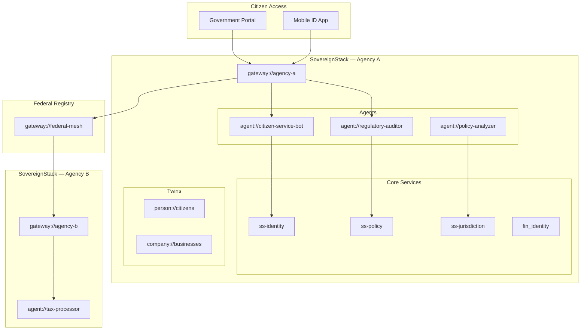

# Reference Architecture: Government

**Version:** 1.0  
**Status:** Draft  
**Profile:** [Sovereign Government Profile](../../profiles/government/profile.yaml)

---

## Overview

This reference architecture describes how SovereignStack deploys for government and public-sector operations, covering citizen services, inter-agency data sharing, and regulatory enforcement.

---

## Architecture Diagram

---

## Component Mapping

| Government Domain | SovereignStack Component | URI Scheme |
|---|---|---|
| Citizen identity | `ss-identity` + eIDAS integration | `person://`, `citizen://` |
| Business registry | `ss-identity` | `company://` |
| Permit management | `ss-policy` + `ss-workflow` | `permit://` |
| Case management | `ss-workflow` | `case://` |
| Inter-agency sharing | `ss-federation` | `gateway://` federation |
| Tax processing | `ss-economy/tax` | `tax://` |
| Regulatory enforcement | `ss-economy/fin_compliance` | `regulation://` |
| Audit trail | `ss-provenance` | `evidence://` |

---

## Key Workflows

1. **Citizen data request**: Citizen authenticates via eIDAS/OIDC → `capability://` issued → data retrieved from `person://` twin
2. **Inter-agency sharing**: Agency A shares `case://` data with Agency B via `gateway://` with jurisdictional gating
3. **Regulatory audit**: `agent://regulatory-auditor` generates compliance report against `regulation://` rules
4. **Tax filing**: `ss-economy/tax` computes obligations, files via `ComplianceEngine`

---

## Compliance

| Framework | Coverage |
|---|---|
| GDPR | Data sovereignty, right to erasure, consent via capability tokens |
| NIS2 | Network security, incident reporting via event bus |
| NIST 800-53 | Full control mapping via OASA CCM |
| eIDAS | Citizen identity integration via OIDC |
| FedRAMP | Cloud deployment profile at OASA L3 |
