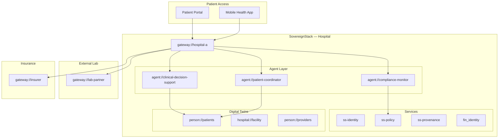

# Reference Architecture: Healthcare

**Version:** 1.0  
**Status:** Draft  
**Profile:** [Sovereign Healthcare Profile](../../profiles/healthcare/profile.yaml)

---

## Overview

This reference architecture describes how SovereignStack deploys in healthcare, covering patient data sovereignty, clinical decision support, inter-provider data exchange, and regulatory compliance.

---

## Architecture Diagram



---

## Component Mapping

| Healthcare Domain | SovereignStack Component | URI Scheme |
|---|---|---|
| Patient identity | `ss-identity` + consent management | `person://` (patient) |
| Provider identity | `ss-identity` + credential verification | `person://` (provider) |
| Facility management | Digital twin framework | `hospital://` |
| Medical records | `ss-cas` (content-addressed) | Stored under `person://` twin memory |
| Clinical decisions | `agent://clinical-decision-support` | Reasoning traces in `reason://` |
| Lab results | Federated via `gateway://` | `evidence://` provenance-linked |
| Insurance claims | `ss-economy/insurance` | `insurance://` claims |
| Prescriptions | Signed artifacts | `artifact://` with provider signature |

---

## Patient Data Sovereignty

The core principle: **the patient owns their data**.

```
Patient (person://alice)
  └── Grants capability:// to hospital://charite
       └── Scoped to: diagnosis://, prescription://
       └── Time-bound: 2026-01-01 to 2027-01-01
       └── Revocable at any time
```

---

## Key Workflows

1. **Patient referral**: Provider A shares `person://` twin subset with Provider B via `gateway://` + capability token
2. **Clinical trial matching**: `agent://trial-analyzer` scans de-identified records for eligibility
3. **Insurance claim**: Diagnosis → prescription → claim filed via `ss-economy/insurance`
4. **Audit**: `ss-provenance` provides full chain of custody for all medical data access

---

## Compliance

| Framework | Coverage |
|---|---|
| HIPAA | Access controls, audit logging, de-identification |
| HL7 FHIR | Data model mapping to SovereignStack objects |
| GDPR | Patient consent via capability tokens |
| 21 CFR Part 11 | Electronic signatures on prescriptions/diagnoses |
