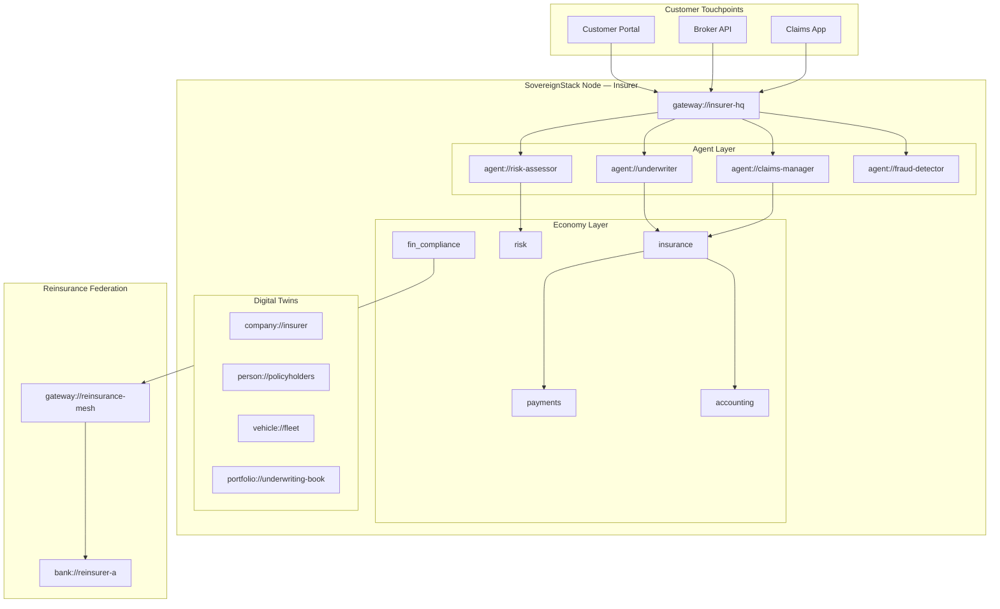

# Reference Architecture: Insurance

**Version:** 1.0  
**Status:** Draft  
**Profile:** [Sovereign Finance Profile (SFIN)](../../profiles/finance/profile.yaml)

---

## Overview

This reference architecture describes how SovereignStack deploys in insurance operations, covering underwriting, claims processing, risk modeling, and reinsurance coordination.

---

## Architecture Diagram

---

## Component Mapping

| Insurance Domain | SovereignStack Component | URI Scheme |
|---|---|---|
| Policyholder identity | `ss-identity` + `fin_identity` | `person://`, `company://` |
| Policy management | `ss-economy/insurance` | `insurance://` |
| Claims processing | `ss-economy/insurance` (Claim) | Filed against `insurance://` |
| Risk modeling | `ss-economy/risk` | Computed on `portfolio://` |
| Premium collection | `ss-economy/payments` | `payment://` |
| Reserving | `ss-economy/accounting` | `account://` |
| Reinsurance | `ss-federation` | Federated `insurance://` objects |
| Fraud detection | `agent://fraud-detector` | Pattern analysis on event stream |

---

## Key Workflows

1. **Quote & Bind**: Risk assessment → premium calculation → `InsurancePolicy` creation
2. **Claims FNOL**: Claim filed → evidence attached → `agent://claims-manager` adjudicates
3. **Reinsurance treaty**: Federated sharing of `insurance://` risk objects across `gateway://`
4. **Portfolio analysis**: `agent://risk-assessor` runs VaR across underwriting book

---

## Compliance

| Framework | Coverage |
|---|---|
| Solvency II | Capital requirements via `ss-economy/risk` |
| IFRS 17 | Insurance contract accounting via `ss-economy/accounting` |
| GDPR | Customer data sovereignty via `ss-policy` + jurisdictional gating |
| DORA | Operational resilience via continuity manifests (RFC-0052) |
