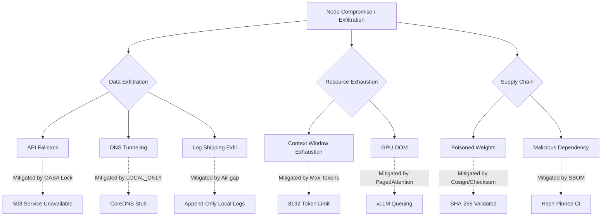

# SovereignStack Threat Model

**Document Revision:** 1.0 — May 2026  
**Scope:** OASA-compliant sovereign AI node deployments  
**Classification:** Internal — Enterprise Risk Assessment

---

## 1. Methodology

This threat model follows the [STRIDE](https://en.wikipedia.org/wiki/STRIDE_(security)) methodology per asset category and the [OWASP AI Security](https://owasp.org/www-project-ai-security/) taxonomy for AI-specific risks. Trust boundaries are defined by the [SovereignStack Architecture](../architecture_guide.md).

| Classification | Definition |
|---|---|
| **Critical** | Node compromise, data exfiltration, regulatory penalty |
| **High** | Service denial, policy bypass, audit tampering |
| **Medium** | Performance degradation, partial information disclosure |
| **Low** | Non-compliance with best practices, observability gaps |

---

## 2. Assets & Trust Boundaries

```
                    ┌──────────────────────────────────────┐
                    │         PUBLIC / CLIENT NET           │
                    │  (TLS 1.3 — Authenticated Clients)    │
                    └──────────────┬───────────────────────┘
                                   │
                         ┌─────────▼─────────┐
                         │   TRUST BOUNDARY   │
                         │   GATEWAY ZONE     │
                         │  (OIDC + OPA)      │
                         └─────────┬─────────┘
                                   │
              ┌────────────────────┼────────────────────┐
              │                    │                     │
     ┌────────▼────────┐  ┌───────▼────────┐  ┌────────▼────────┐
     │  COMPUTE ZONE    │  │  MEMORY ZONE    │  │   AUDIT ZONE    │
     │ (gVisor Sandbox) │  │ (Encrypted DB)  │  │ (Append-Only)   │
     │ Model Weights    │  │ Vector DB       │  │ Audit Logs      │
     │ Activation Cache │  │ KV Cache        │  │ Merkle Hashes    │
     └─────────────────┘  └────────────────┘  └─────────────────┘
              │                    │                     │
              └────────────────────┼─────────────────────┘
                                   │
                         ┌─────────▼─────────┐
                         │   TRUST BOUNDARY   │
                         │   STORAGE ZONE     │
                         │ (TPM-Bound AES-256)│
                         └───────────────────┘
```

### 2.1 Asset Inventory

| Asset ID | Asset | Zone | Confidentiality | Integrity | Availability |
|---|---|---|---|---|---|
| A-001 | Model Weights (INT4/AWQ) | Compute | Critical | High | High |
| A-002 | User Prompts / Inference I/O | Gateway → Compute | Critical | High | Medium |
| A-003 | Vector Embeddings | Memory | Critical | High | Medium |
| A-004 | OIDC JWT Tokens / Keys | Gateway | Critical | Critical | High |
| A-005 | OPA Rego Policies | Gateway | High | Critical | High |
| A-006 | Audit Logs | Audit | High | Critical | Medium |
| A-007 | TPM-Bound Encryption Keys | Hardware | Critical | Critical | Critical |
| A-008 | Network Configuration | All | Medium | High | High |

---

---

## 3. Attack Tree (Formal Threat Model)

The following attack tree models potential paths to a full node compromise.



## 4. Threat Catalogue

### 3.1 Data Exfiltration

| ID | Threat | STRIDE | Severity | Mitigation |
|---|---|---|---|---|
| **T-001** | Prompt exfiltration via external API fallback when local compute fails | Spoofing | **Critical** | OASA compliance lock enforces 503. Network Policy blocks all WAN egress. |
| **T-002** | DNS exfiltration — model data encoded in DNS queries to external resolvers | Information Disclosure | **Critical** | `dns_mode: LOCAL_ONLY` in node config. CoreDNS configured with stub-only resolution. |
| **T-003** | Side-channel via timing / response-length leakage | Information Disclosure | **Medium** | Fixed-padding response format. Jitter added to response timing (±20ms). |
| **T-004** | Embedded metadata exfiltration in log/audit shipping | Information Disclosure | **High** | Audit logs are local append-only. No remote syslog forwarding in air-gapped mode. |
| **T-005** | Covert channel via GPU temperature / power monitoring | Information Disclosure | **Low** | No remote telemetry in air-gapped mode. Prometheus metrics bound to local loopback. |

### 3.2 Supply Chain & Model Poisoning

| ID | Threat | STRIDE | Severity | Mitigation |
|---|---|---|---|---|
| **T-010** | Tampered model weights from MITM during download | Tampering | **Critical** | SHA-256 hash verification on download. Cosign signature verification for published models. |
| **T-011** | Malicious adapter/LoRA weights with backdoor triggers | Tampering | **High** | Adapter weights are checksummed and scanned against known hash allowlist. |
| **T-012** | Compromised base container image (vLLM, PyTorch) | Tampering | **Critical** | Image digest pinning in docker-compose.yml. SBOM generation in CI. |
| **T-013** | Dependency confusion — typosquatted Python packages | Tampering | **High** | `requirements.txt` pins exact versions with `--require-hashes` in production. |
| **T-014** | Hardware trojan — compromised TPM or GPU firmware | Tampering | **Low** | Out of scope for software layer. Requires physical supply chain audit. |

### 3.3 Denial of Service & Resource Exhaustion

| ID | Threat | STRIDE | Severity | Mitigation |
|---|---|---|---|---|
| **T-020** | Context-window exhaustion — unbounded KV cache growth | Denial of Service | **High** | `max_token_context: 8192` hard cap. OPA policy limits per-role context length. |
| **T-021** | GPU memory OOM from concurrent requests | Denial of Service | **High** | vLLM PagedAttention + `gpu_memory_utilization: 0.90`. Request queue depth limit. |
| **T-022** | Disk-fill attack via audit log flooding | Denial of Service | **Medium** | Audit log rotation with size cap. Rate limiting on `/v1/chat/completions`. |
| **T-023** | Vector DB index corruption from malformed ingestion | Tampering | **Medium** | Strict JSON schema validation on ingest. Rollback to previous checkpoint. |

### 3.4 Authentication & Authorization Bypass

| ID | Threat | STRIDE | Severity | Mitigation |
|---|---|---|---|---|
| **T-030** | JWT forgery or stolen bearer token | Spoofing | **Critical** | OIDC provider (Keycloak) validates signature, `exp`, `aud`. Token revocation via Keycloak admin. |
| **T-031** | Privilege escalation — user gains access to higher-parameter model | Elevation of Privilege | **High** | OPA policy enforces `model_budget` per role. RBAC scoped to `inference:write`. |
| **T-032** | Internal service-to-service without mTLS | Spoofing | **High** | Docker Compose `internal: true` network limits to bridge. K8s NetworkPolicy for production. |
| **T-033** | Session replay attack | Repudiation | **Medium** | JWT `jti` claim checked for replay. Audit log timestamps with monotonic clock. |

### 3.5 Audit Tampering

| ID | Threat | STRIDE | Severity | Mitigation |
|---|---|---|---|---|
| **T-040** | Log deletion or truncation by attacker | Tampering | **Critical** | Append-only log file. Merkle-tree chaining (future). WORM filesystem for production. |
| **T-041** | Log injection via crafted prompts | Tampering | **Medium** | JSON-encoded audit payloads. Newline and control-character stripping in log writer. |
| **T-042** | Timestamp manipulation via system clock tampering | Tampering | **High** | monotonic clock (`time.monotonic_ns()`) for sequencing. NTP with local stratum-1 in air-gap. |

### 3.6 AI-Specific Risks

| ID | Threat | STRIDE | Severity | Mitigation |
|---|---|---|---|---|
| **T-050** | Prompt injection — attacker manipulates model via crafted input | Tampering | **High** | OPA DLP policy block on known injection patterns. System prompt hardening. |
| **T-051** | Training data memorization — model regurgitates PII | Information Disclosure | **High** | Quantized models have reduced memorization. Output scanning via OPA. |
| **T-052** | Model inversion — extract training data from weights | Information Disclosure | **Medium** | INT4 quantization adds noise that reduces inversion efficacy. |
| **T-053** | Adversarial examples — imperceptible input perturbations | Denial of Service | **Medium** | Input normalization layer. OPA policy for outlier detection. |

---

## 4. Network Attack Surface

| Interface | Protocol | Port | Exposure | Risk |
|---|---|---|---|---|
| Gateway API | HTTPS (TLS 1.3) | 8080 | Internal / VPN | **Low** — OIDC + OPA gated |
| vLLM Inference | HTTP | 8000 | `internal: true` only | **Low** — not routable externally |
| Memory Service | HTTP | 8082 | `internal: true` only | **Low** — not routable externally |
| Ingest Service | HTTP | 8081 | `internal: true` only | **Low** — not routable externally |
| Keycloak Admin | HTTPS | 8443 | Internal / VPN | **Medium** — administrative |

### 4.1 Egress Rules (Air-Gapped Mode)

| Destination | Protocol | Action | Rationale |
|---|---|---|---|
| `0.0.0.0/0` | ALL | **DENY** | Zero egress in air-gapped mode |
| `10.0.0.0/8` | TCP/UDP | ALLOW | Internal cluster communication |
| `192.168.0.0/16` | TCP/UDP | ALLOW | Internal cluster communication |
| Localhost | ALL | ALLOW | Health checks, Prometheus scraping |

---

## 5. Compliance Mapping

| Regulation | Relevant Threats | Controls |
|---|---|---|
| **GDPR Art. 5** | T-001, T-002, T-004 | Zero exfiltration, data locality, immutable audit |
| **GDPR Art. 32** | T-030, T-007 | OIDC auth, TPM-bound encryption |
| **EU AI Act Art. 15** | T-050, T-051, T-053 | OPA DLP, output scanning, human oversight |
| **HIPAA §164.312** | T-007, T-030, T-040 | AES-256, access control, audit controls |
| **NIS2 Art. 21** | T-010, T-012, T-020 | Supply chain security, SBOM, resource isolation |
| **DORA Art. 11** | T-020, T-021, T-022 | Operational resilience, rate limiting |

---

## 6. Residual Risk & Acceptance

| Risk | Rationale | Decision |
|---|---|---|
| Physical tampering with TPM/HSM | Requires physical access to hardware | Accepted — mitigated by data center access controls |
| Zero-day in Linux kernel / gVisor | Out of project scope | Accepted — monitored via vendor security advisories |
| Model supply chain (HuggingFace compromise) | Cosign verification mitigates but does not eliminate | Accepted — air-gapped orgs pin and scan manually |

---

## 7. Incident Response

1. **Detection** — Audit log anomaly (unusual request patterns, repeated OPA violations)
2. **Containment** — Revoke OIDC tokens via Keycloak. Block node at network level.
3. **Eradication** — Rotate TPM-bound encryption keys. Re-deploy from clean images.
4. **Recovery** — Restore vector DB from last known-good checkpoint. Resume from audit trail.
5. **Post-Mortem** — Update OPA policies. Revise threat model. File MITRE ATT&CK report.

---

## 8. References

- [OWASP AI Security](https://owasp.org/www-project-ai-security/)
- [MITRE ATLAS](https://atlas.mitre.org/) — AI-specific adversary tactics
- [NIST AI 100-2](https://www.nist.gov/artificial-intelligence) — AI risk management
- [SovereignStack Architecture Guide](../architecture_guide.md)
